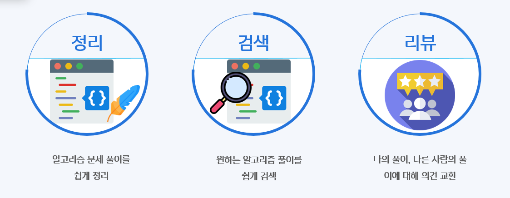
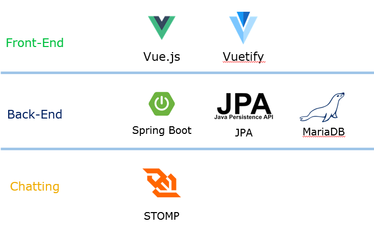

# 다우기술 인턴 3조(신소전도) 팀 프로젝트 - 알려다우

## #01 팀원 구성

| 이름   | 사번  |
| ------ | ----- |
| 이정건 | 90811 |
| 배민영 | 90813 |
| 황영준 | 90817 |

## #02 프로젝트 소개

### 프로젝트 개요

- 알고리즘 문제를 풀며 자신의 풀이를 쉽게 정리해 놓고 필요할 때 찾아볼 수 있는 서비스
- 다른 사람의 풀이를 참고하며 그에 대해 질문을 하거나, 토론을 할 수 있는 서비스

### 주요 기능

- 별도의 마크다운 파일을 만들 필요 없이 웹 화면에 바로 알고리즘 문제 풀이를 정리
- 문제 번호, 플랫폼 등의 키워드를 통해 확인하고자 하는 문제의 풀이를 쉽게 검색
- 풀이가 이해가 가지 않는 점이 있으면 질문하고 그에 대한 자유로운 의견 교환

 

## #03 기술 스택

### Front-End

- Vue.js: 팀원들의 템플릿 엔진 사용 경험이 없기 때문에 JSP 대신 SPA 기술 중 React.js에 비해 진입 장벽이 낮은 Vue.js를 도입하였습니다.
- Vuetify: vue에 적용할 수 있는 css framework로서 프로젝트 기간이 단기간이므로 생산성을 높이기 위해 도입하였습니다.

### Back-End

- Spring boot: 경험 횟수의 차이는 있으나 모든 팀원이 공통적으로 사용해 본 framework이기 때문에 선택하였습니다.
- JPA: MyBatis와 비교하여 Spring data JPA를 이용하면 보다 높은 생산성을 얻을 수 있으므로 선택하였습니다.
- MariaDB: 회사로부터 원격 DB 인스턴스를 제공받아 사용하였습니다.

### Chatting

- 실시간 채팅을 해야 하므로 웹 소켓과 메시지 브로커인 Stomp를 도입하여 사용하였습니다.

 

## #04 업무 분담

### 업무 분담

| 이름   | 업무                  |
| ------ | --------------------- |
| 이정건 | 게시글 관련 기능 담당 |
| 황영준 | 회원 관련 기능 담당   |
| 배민영 | 채팅 관련 기능 담당   |

각 팀원은 담당 업무가 일찍 끝나게 되면 다른 도움이 필요한 팀원의 업무를 함께 분담하여 진행할 예정입니다.

 

### 담당 코드

#### 이정건

| 파일명              | 설명                                                         |
| ------------------- | ------------------------------------------------------------ |
| views/BoardView.vue | 메인 페이지, 게시글의 목록을 카드 형태로 표현                |
| components/Card.vue | 메인 페이지에 보여질 각 게시글 컴포넌트, BoardView의 자식 컴포넌트 |

 

#### 배민영

| 파일명                                 | 설명                                                         |
| -------------------------------------- | ------------------------------------------------------------ |
| views/BoardDetailView.vue              | 게시글 확인 페이지, 게시글을 클릭했을 때 풀이를 확인하는 화면 |
| components/ChatComponents/Board.vue    | 게시글 확인 페이지에서 문제에 대한 정보를 담고 있는 컴포넌트 |
| components/ChatComponents/ChatList.vue | 게시글 확인 페이지에서 채팅에 대한 정보를 담고 있는 컴포넌트 |
| components/ChatComponents/Code.vue     | 게시글 확인 페이지에서 코드에 대한 정보를 담고 있는 컴포넌트 |
| components/ChatComponents/SendChat.vue | 게시글 확인 페이지의 채팅입력을 담당하는 컴포넌트            |

 

#### 황영준

| 파일명                                 | 설명                                                         |
| -------------------------------------- | ------------------------------------------------------------ |
| App.vue                                | 메뉴 틀 구현, router-view에 컴포넌트를 갈아 끼우며 화면에 표시 |
| views/SignInView.vue                   | 회원가입 화면, Signin, Signup 두 컴포넌트를 자식 컴포넌트로 소유 |
| store/index.js                         | Vuex 설정 파일, 로그인, 로그 아웃과 관련된 로직              |
| router/index.js                        | vue-router 설정 파일,  각 페이지별 라우팅 설정을 포함        |
| components/SignInComponents/SignIn.vue | 로그인 컴포넌트, SignInView의 자식 컴포넌트                  |
| components/SignInComponents/SignUp.vue | 회원가입 컴포넌트, SignInView의 자식 컴포넌트                |

 