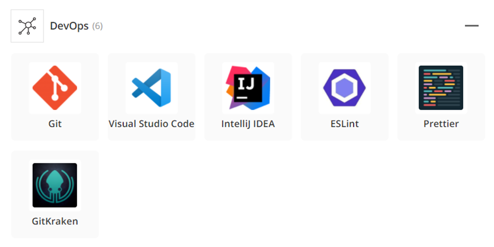
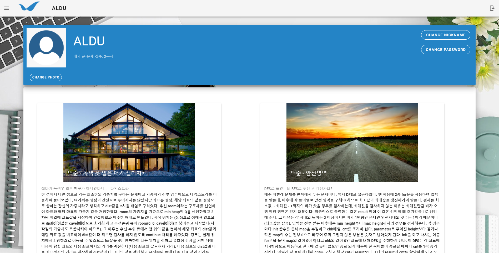
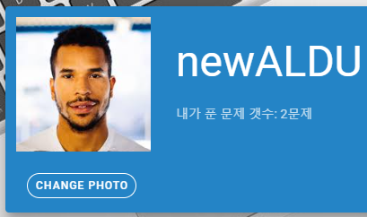

# 다우기술 인턴 3조(신소전도) 팀 프로젝트 - 알려다우

## #01 팀원 구성

| 이름   | 사번  |
| ------ | ----- |
| 이정건 | 90811 |
| 배민영 | 90813 |
| 황영준 | 90817 |

## #02 프로젝트 소개

### 프로젝트 개요

- 알고리즘 문제를 풀며 자신의 풀이를 쉽게 정리해 놓고 필요할 때 찾아볼 수 있는 서비스
- 다른 사람의 풀이를 참고하며 그에 대해 질문을 하거나, 토론을 할 수 있는 서비스

### 주요 기능

- 별도의 마크다운 파일을 만들 필요 없이 웹 화면에 바로 알고리즘 문제 풀이를 정리
- 문제 번호, 플랫폼 등의 키워드를 통해 확인하고자 하는 문제의 풀이를 쉽게 검색
- 풀이가 이해가 가지 않는 점이 있으면 질문하고 그에 대한 자유로운 의견 교환

 

## #03 기술 스택

### Front-End

- Vue.js: 팀원들의 템플릿 엔진 사용 경험이 없기 때문에 JSP 대신 SPA 기술 중 React.js에 비해 진입 장벽이 낮은 Vue.js를 도입하였습니다.
- Vuetify: vue에 적용할 수 있는 css framework로서 프로젝트 기간이 단기간이므로 생산성을 높이기 위해 도입하였습니다.

### Back-End

- Spring boot: 경험 횟수의 차이는 있으나 모든 팀원이 공통적으로 사용해 본 framework이기 때문에 선택하였습니다.
- JPA: MyBatis와 비교하여 Spring data JPA를 이용하면 보다 높은 생산성을 얻을 수 있으므로 선택하였습니다.
- MariaDB: 회사로부터 원격 DB 인스턴스를 제공받아 사용하였습니다.

### Chatting

- 실시간 채팅을 해야 하므로 웹 소켓과 메시지 브로커인 Stomp를 도입하여 사용하였습니다.

 

## #04 업무 분담

### 업무 분담

| 이름   | 업무                  |
| ------ | --------------------- |
| 이정건 | 게시글 관련 기능 담당 |
| 황영준 | 회원 관련 기능 담당   |
| 배민영 | 채팅 관련 기능 담당   |

각 팀원은 담당 업무가 일찍 끝나게 되면 다른 도움이 필요한 팀원의 업무를 함께 분담하여 진행할 예정입니다.

 

### 담당 코드

#### 이정건

| 파일명              | 설명                                                         |
| ------------------- | ------------------------------------------------------------ |
| views/BoardView.vue | 메인 페이지, 게시글의 목록을 카드 형태로 표현, 검색 기능 추가 |
| components/Card.vue | 메인 페이지에 보여질 각 게시글 컴포넌트, BoardView의 자식 컴포넌트 |

 

#### 배민영

| 파일명                                    | 설명                                                         |
| ----------------------------------------- | ------------------------------------------------------------ |
| views/BoardDetailView.vue                 | 게시글 확인 페이지, 게시글을 클릭했을 때 풀이를 확인하는 화면 |
| components/ChatComponents/Board.vue       | 게시글 확인 페이지에서 문제에 대한 정보를 담고 있는 컴포넌트 |
| components/ChatComponents/ChatList.vue    | 게시글 확인 페이지에서 채팅에 대한 정보를 담고 있는 컴포넌트 |
| components/ChatComponents/Code.vue        | 게시글 확인 페이지에서 코드에 대한 정보를 담고 있는 컴포넌트 |
| components/ChatComponents/SendChat.vue    | 게시글 확인 페이지의 채팅입력을 담당하는 컴포넌트            |
| components/ChatComponents/ChatView.vue    | 게시글 확인 페이지의 채팅 목록 컴포넌트                      |
| components/ChatComponents/UserProfile.vue | 채팅시 각 유저를 구분하기 위한 아이콘 컴포넌트               |

 

#### 황영준

| 파일명                            | 설명                                                         |
| --------------------------------- | ------------------------------------------------------------ |
| App.vue                           | 메뉴 틀 구현, router-view에 컴포넌트를 갈아 끼우며 화면에 표시 |
| views/SignInView.vue              | 회원가입 화면, Signin, Signup 두 컴포넌트를 자식 컴포넌트로 소유 |
| views/CreatePostView.vue          | post 작성 화면, CreatePostComponents 이하 4개의 자식컴포넌트로 구성 |
| views/MyPageView.vue              | mypage 화면, Card, Profile 두 컴포넌트를 자식 컴포넌트로 소유 |
| store/index.js                    | Vuex 설정 파일, 로그인, 로그 아웃과 관련된 로직              |
| router/index.js                   | vue-router 설정 파일,  각 페이지별 라우팅 설정을 포함        |
| components/SignInComponents/*     | 로그인, 회원가입 기능을 갖는 SignIn, SignUp 컴포넌트         |
| components/MypageComponents/*     | Mypage를 구성하는 Profile, Card 컴포넌트                     |
| components/CreatePostComponents/* | CreatePostView 내부에 들어갈 4개의 큰 컴포넌트와 각 컴포넌트를 구성하는 자식 컴포넌트로 구성 |

 

## #05 구현 결과

### 1. 회원가입 및 로그인

#### 1-1. 유저 회원가입

- 회원가입 시에는 비밀번호를 8자 이상 입력해야 한다.
- 비밀번호가 8자보다 짧거나, 비밀번호와 비밀번호 확인이 일치하지 않으면 회원가입 버튼이 활성화 되지 않는다.

#### 1-2. 유저 로그인

- 회원가입 시에 입력한 ID와 패스워드를 통해 로그인한다.

### 2. 마이페이지

#### 2-1. 마이페이지

- 로그인한 사용자는 마이페이지에  접근할 수 있다.
- 마이 페이지에서는 프로필 사진, 닉네임, 패스워드를 변경할 수 있다.
- 마이 페이지에서는 자신이 올렸던 문제 풀이를 확인할 수 있다.

#### 2-2. 프로필 사진 변경

- 유저는 프로필 사진 변경 메뉴를 통해 프로필 사진을 변경할 수 있다.
- 프로필 사진의 확장자는 jpg로 제한한다.

#### 2-3. 닉네임 변경

- 유저는 닉네임 변경 메뉴를 통해 자신의 닉네임을 변경할 수 있다.

#### 2-4. 패스워드 변경

- 유저는 패스워드 변경 메뉴를 통해 자신의 패스워드를 변경할 수 있다.

### 3. 게시글 작성

- 사용자는 게시글을 작성할 때 게시글 정보, 문제 정보, 풀이 코드를 입력해야 한다.
- 모든 입력란이 채워지지 않으면 게시글이 게시되지 않는다.

#### 3-1. 게시글 정보 작성

- 게시글 제목과 자신이 해당 문제를 어떻게 풀었는지에 대한 풀이를 작성한다.

#### 3-2. 문제 정보 작성

- 자신이 풀었던 문제에 대한 정보를 입력한다.
- 문제의 출처, 문제의 제목, 문제의 링크를 순서를 입력한다.
- 문제 링크의 경우 풀이를 보며 문제를 확인하기 위해 필요하며, url 형식이 아니면 게시글이 제출되지 않는다.

#### 3-3. 풀이 코드 작성

- 자신이 해당 문제를 풀었던 코드를 입력한다.
- 코드 입력 후 하단의 Check Code 버튼을 클릭하면 옆 화면에서 하이라이팅 된 깔끔한 코드를 확인할 수 있다.

#### 3-4. 코드 하이라이팅 확인

- 사용자가 입력한 소스 코드를 언어별로 하이라이팅 하여 화면에 보여준다.

### 4. 게시글 열람 및 검색

#### 4-1. 문제 출처 검색

- 유저는 보고싶은 문제 출처만 선택하여 게시글을 필터링하여 확인할 수 있다.

#### 4-2. 문제 풀이 언어로 검색

- 유저는 프로그래밍 언어를 선택하여 자신이 사용하는 언어로 된 게시글만 확인할 수 있다.

#### 4-3. 검색어를 이용한 검색

- 유저는 검색어를 활용하여 게시글을 필터링하여 확인할 수 있다.
- 검색 결과는 검색어가 게시글 제목 뿐 아니라 본문에 포함된 경우까지 보여준다. 

#### 4-4. 게시글 열람

- 유저는 원하는 게시글을 클릭하여 문제 풀이 정보를 확인할 수 있다.
- 문제에 대한 정보를 확인할 수 있으며, 문제 링크 클릭시 새 창에서 문제 페이지를 볼 수 있다.
- 오른쪽에서는 글쓴이가 문제를 풀었던 코드를 가독성 좋게 하이라이팅된 것을 확인할 수 있다.
- 문제 풀이 아래에는 해당 문제 풀이에 대한 의견 교환이 가능하도록 채팅창을 배치하였다.

### 5. 채팅

#### 5-1. 채팅방 입장

- 유저가 채팅방에 입장하면 이전의 채팅 기록을 확인할 수 있다.
- 유저는 이를 통해 자신이 하고자 하는 질문이 이전에도 있었는지를 확인할 수 있다.

#### 5-2. 채팅 입력

- 해당 문제를 보고있는 유저들 끼리는 실시간으로 채팅을 할 수 있다.
- 유저들은 이를 통해 해당 문제에 대해 실시간으로 의견 교환을 할 수 있다.

